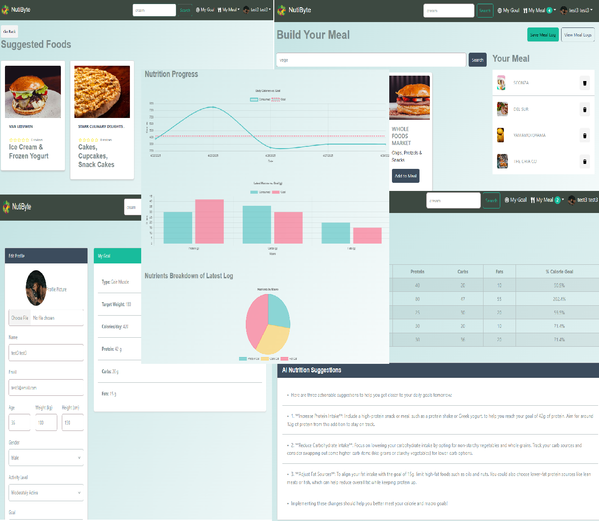

# NutriByte Food Tracking App

> Food Tracking App built with the MERN stack & Redux.

This is a MERN project using Redux Toolkit, Chart JS and OpenAI API. 
Here is the live Demo [NutriByte](https://nutribyte-2.onrender.com)



<!-- toc -->

- [Features](#features)
- [Usage](#usage)
  - [Env Variables](#env-variables)
  - [Install Dependencies (frontend & backend)](#install-dependencies-frontend--backend)
  - [Run](#run)
- [Build & Deploy](#build--deploy)
  - [Seed Database](#seed-database)

<!-- tocstop -->

## Features

- User profile(Registration, Login, Logout, Profile picture, Profile Update)
- Admin User and Food Management
- Food Search
- Food Rating
- Meal Builder
- Nutrition Logs
- Nutrition Goals(Set and Compare)
- Nutrition Graphs
- AI Nutrition Suggestions from Nutrition Logs Data
- Database seeder (Food, users, Nutrition Logs)

## Usage

- Create a MongoDB database and obtain your `MongoDB URI` - [MongoDB Atlas](https://www.mongodb.com/cloud/atlas/register)

### Env Variables

Rename the `.env.example` file to `.env` and add the following

```
NODE_ENV = development
PORT = 5000
MONGO_URI = your mongodb uri
JWT_SECRET = 'abc123'
PAGINATION_LIMIT = 8
OPENAI_API_KEY=<Your OPEN AI API Key>
```

Change the JWT_SECRET and PAGINATION_LIMIT to what you want

### Install Dependencies (frontend & backend)

```
npm install
cd frontend
npm install
```

### Run

```

# Run frontend (:3000) & backend (:5000)
npm run dev

# Run backend only
npm run server
```

## Build & Deploy

```
# Create frontend prod build
cd frontend
npm run build
```

### Seed Database

You can use the following commands to seed the database with some sample users and foods as well as destroy all data

```
# Import data
npm run data:import

# Destroy data
npm run data:destroy
```

```
Sample User Logins

mike@email.com (Admin)
123456

mbout@email.com (User)
123456

bob@email.com (User)
123456

admin@email.com (User)
123456
```
# NutriByte MERN CI/CD on AWS

## 1. Prerequisites
- This project was also deploy on AWS using AWS Cloud services and setup a high availability server 
on a completely different project.
```


---

